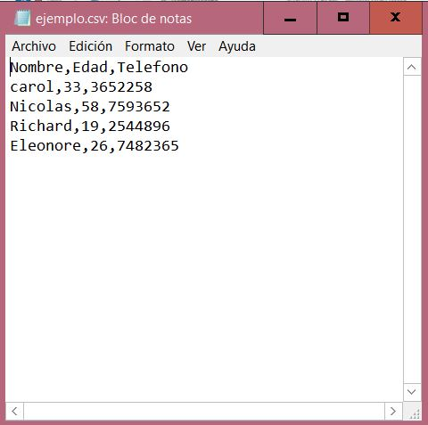
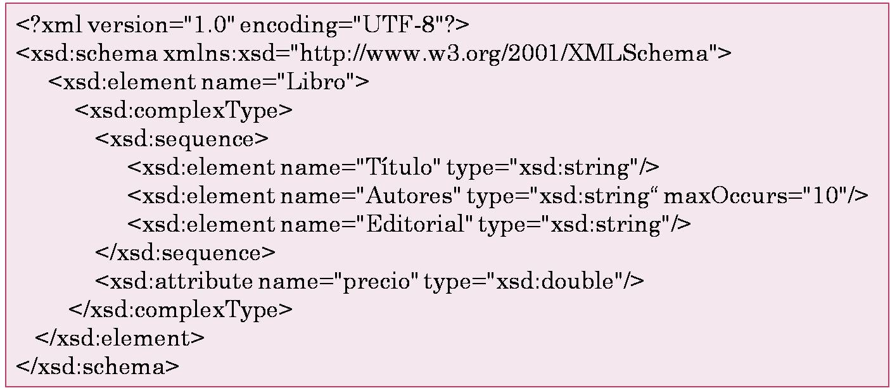

<section id="themes">
	<h2>Themes</h2>
		<p>
			Set your presentation theme: <br>
			<!-- Hacks to swap themes after the page has loaded. Not flexible and only intended for the reveal.js demo deck. -->
                        <a href="#" onclick="document.getElementById('theme').setAttribute('href','css/theme/black.css'); return false;">Black (default)</a> -
			<a href="#" onclick="document.getElementById('theme').setAttribute('href','css/theme/white.css'); return false;">White</a> -
			<a href="#" onclick="document.getElementById('theme').setAttribute('href','css/theme/league.css'); return false;">League</a> -
			<a href="#" onclick="document.getElementById('theme').setAttribute('href','css/theme/sky.css'); return false;">Sky</a> -
			<a href="#" onclick="document.getElementById('theme').setAttribute('href','css/theme/beige.css'); return false;">Beige</a> -
			<a href="#" onclick="document.getElementById('theme').setAttribute('href','css/theme/simple.css'); return false;">Simple</a> <br>
			<a href="#" onclick="document.getElementById('theme').setAttribute('href','css/theme/serif.css'); return false;">Serif</a> -
			<a href="#" onclick="document.getElementById('theme').setAttribute('href','css/theme/blood.css'); return false;">Blood</a> -
			<a href="#" onclick="document.getElementById('theme').setAttribute('href','css/theme/night.css'); return false;">Night</a> -
			<a href="#" onclick="document.getElementById('theme').setAttribute('href','css/theme/moon.css'); return false;">Moon</a> -
			<a href="#" onclick="document.getElementById('theme').setAttribute('href','css/theme/solarized.css'); return false;">Solarized</a>
		</p>
</section>

H:

# Data


H:

# Index

 1. Introducción <!-- .element: class="fragment" data-fragment-index="1"-->
 1. CSV <!-- .element: class="fragment" data-fragment-index="2"-->
 1. XML <!-- .element: class="fragment" data-fragment-index="3"-->
 1. JSON <!-- .element: class="fragment" data-fragment-index="4"-->
 
H:

## Introduccion

En ocasiones es necesario tener información aparte del código

<li class="fragment"> Organizar
<li class="fragment"> Recopilar 
<li class="fragment"> Cambiar 
V:

## Introduccion

Processing nos brinda la oportunidad de trabajar en distintos formatos para lograr esto

Cada uno con sus distintas fortalezas para que cada programador escoja a su gusto

H:

## CSV 
 comma-separated values
> Los archivos CSV son un tipo de documento en formato abierto sencillo para representar datos en forma de tabla

V:

## ejemplo tabla

<figure>
    
    <figcaption>Columnas " , " y Filas salto de linea</figcaption>
</figure>


V:

## CSv
Ventajas

<li class="fragment"> Una sencillez muy practica a la hora de trabajar
<li class="fragment"> Como es una clase propia de Processing cuenta con facilidades para el manejo de informacion

V:

## csv
Ejemplo:

> La ubicación de los puntos en el juego de Euler

V:

## csv
Ejemplo:
Primero declararemos las tablas que necesitaremos junto con los objetos

V:

## csv
Ejemplo:

```processing
Circle[] circles;
Rectangle[] rectangles;

Table puntos;
Table lineas;
Table contador;

void setup() {
  size(500, 500);
  puntos=loadTable ("puntos.csv");
  contador=loadTable ("puntos.csv");
  lineas=loadTable ("lineas.csv");

  circles = new Circle[6];
  for (int i = 0; i < circles.length; i++)
    circles[i] = new Circle();
  rectangles = new Rectangle[6];
  for (int i = 0; i < rectangles.length; i++)
    rectangles[i] = new Rectangle();
}

void draw() {
  background(229, 218, 218);
  
  for (int i = 0; i <6; i++) {
    rectangles[i].display();
    circles[i].display();
  }

 
 }```

V:

## csv
Ejemplo:

```processing
int i, j;
int aux;
class Node {

  PVector position;
  float size;
  int state;


  Node() {
    while (state==0) {
      if (puntos.getInt(j, i)==1) {
        setPosition(new PVector(i*50+50, j*50+50));
        state=1;
        contador.setInt(j, i, aux+1);
        aux=contador.getInt(j, i);
      }
      if (i>=8&&j>=8) {
        i=8;
        j=8;
        state=1;
      } else if (j<8) {
        j++;
      } else {
        i++;
        j=0;
      }
    }
    println(i, j);
    setSize(25);
    if (i==8&&j==8) {
      i=8;
      j=8;
    } else if (j<8) {
      j++;
    } else {
      i++;
      j=0;
    }
  }


  void setPosition(PVector pos) {
    position = pos;
  }

  void setSize(float s) {
    size = s;
  }


  PVector position() {
    return position;
  }

  float size() {
    return size;
  }
}```

V:

## csv
Ejemplo:

```processing
class Circle extends Node {
  void display() {
    pushStyle();
    strokeWeight(5);
    stroke(2, 4, 15);
    fill(132, 0, 15);
    ellipse(position.x, position.y, size, size);
    popStyle();
  }
 }```

V:

## csv
Ejemplo:

```processing
class Rectangle extends Node {
  void display() {
    pushStyle();
    rectMode(CENTER);
    strokeWeight(5);
    stroke(2, 4, 15);
    fill(229, 149, 0);
    rect(position.x, position.y, size, size);
    popStyle();
  }
}```

H:

## Xml
eXtensible Markup Language

> XML es un subconjunto de SGML, simplificado y adaptado a Internet

V:

## XML
Ejemplo:
<figure>
    
   
</figure>

V:

## XML
Ejemplo:
<figure>
    
   <figcaption>Estructura arbol</figcaption>
</figure>

V:

## xml
Retomando nuestro ejemplo:

```processing
Circle[] circles;
Rectangle[] rectangles;

XML xml;
int recol[];
int puntos[][]=new int[9][9];
String punto;
int aux1;

void setup() {
  size(500, 500);

  xml = loadXML("puntos.xml");
  XML[] children = xml.getChildren("puntos");

  for (int i = 0; i < children.length; i++) {
    String name = children[i].getContent();
    punto=name;
  }

  recol = int(split(punto, ','));

  for (int i=0; i<9; i++) {
    for (int j=0; j<9; j++) {
      puntos[j][i]=recol[aux1];
      println (j, i, puntos[j][i],recol[aux1],aux1);
      aux1=aux1+1;
     
    }
  }
  circles = new Circle[6];
  for (int i = 0; i < circles.length; i++)
    circles[i] = new Circle();
  rectangles = new Rectangle[6];
  for (int i = 0; i < rectangles.length; i++)
    rectangles[i] = new Rectangle();
}


void draw() {
  background(229, 218, 218);

  for (int i = 0; i <6; i++) {
    rectangles[i].display();
    circles[i].display();
  }
}
```

V:

## xml

``` processing
int i, j;
int aux;
class Node {

  PVector position;
  float size;
  int state;


  Node() {
    while (state==0) {
      if (puntos[i][j]==1) {
        setPosition(new PVector(i*50+50, j*50+50));
        state=1;
        
      }
      if (i>=8&&j>=8) {
        i=8;
        j=8;
        state=1;
      } else if (j<8) {
        j++;
      } else {
        i++;
        j=0;
      }
    }
    println(i, j);
    setSize(25);
    if (i==8&&j==8) {
      i=8;
      j=8;
    } else if (j<8) {
      j++;
    } else {
      i++;
      j=0;
    }
  }


  void setPosition(PVector pos) {
    position = pos;
  }

  void setSize(float s) {
    size = s;
  }


  PVector position() {
    return position;
  }

  float size() {
    return size;
  }
}
```

H:

## json
JavaScript Object Notation
> Es un formato de texto ligero para el intercambio de datos. JSON es un subconjunto de la notación literal de objetos de JavaScript aunque hoy, debido a su amplia adopción como alternativa a XML, se considera un formato de lenguaje independiente.

V:

## json


<figure>
    

</figure>

V:

## json


<figure>
    

</figure>
V:

## json

Continuando con el ejemplo:

```processing
Circle[] circles;
Rectangle[] rectangles;

XML xml;
int recol[];
int puntos[][]=new int[9][9];
String punto;
int aux1;
JSONArray json;

void setup() {
  size(500, 500);
  json = loadJSONArray("new.json");
  int values = json.getInt(0);
   println(values);
  for (int i=0; i<9; i++) {
    for (int j=0; j<9; j++) {
      puntos[j][i]=json.getInt(aux1);
      println (j, i, puntos[j][i],aux1);
      aux1=aux1+1;
     
    }
  }
  circles = new Circle[6];
  for (int i = 0; i < circles.length; i++)
    circles[i] = new Circle();
  rectangles = new Rectangle[6];
  for (int i = 0; i < rectangles.length; i++)
    rectangles[i] = new Rectangle();
}


void draw() {
  background(229, 218, 218);

  for (int i = 0; i <6; i++) {
    rectangles[i].display();
    circles[i].display();
  }
}
```

H:

## Idea

> Una sola plantilla para todo el proyecto


